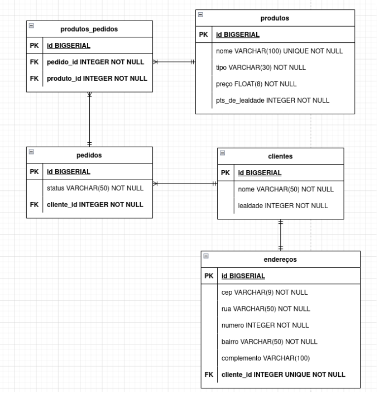

# SQL Lanches

Esta aplicaçãoserve para estruturar um banco de dados que possui todos os tipos de relacionamentos. Aqui temos uma lancheria que vende hambúrgueres, acompanhamentos e bebidas.

As entidades (tabelas) que fazem parte desse contexto são as seguintes:

Clientes
Endereços
Produtos
Pedidos
Produtos_Pedidos (tabela pivô)

 ## **Simulando interações CRUD**

 É possível simular como as ações de criação (create), leitura (read), atualização (update) e deleção (delete) para ter uma ideia de como essas ações se traduzem no contexto do banco de dados.

 ## <strong>ER Diagrama: </strong>   
   

 Tecnologias utilizadas:

 - PostgreSQL
 
 ## **Devs**

 > - [Amanda R. Costa](https://www.linkedin.com/in/amanda-fullstack/)

---

## Iniciando:

Para iniciar a aplicação basta seguir o scrip abaixo:

Clone este respositório e certifique-se de ter o PostgreSQL baixado, assim como o DBeaver para acompanhar as simulações de CRUD e Queries.

 
